# langgraph-cpp 架构文档

| 字段 | 内容 |
| --- | --- |
| 状态 | 生效中 |
| 最后更新 | 2026-07-10 |
| 范围 | Runtime 架构、模块边界、扩展端口和关键执行流程 |
| 关联文档 | [AI_INDEX.md](AI_INDEX.md)、[PRD.md](PRD.md)、[ROADMAP.md](ROADMAP.md)、[API_CONTRACT.md](API_CONTRACT.md)、[QUALITY_MODEL.md](QUALITY_MODEL.md)、[TRACEABILITY_MATRIX.md](TRACEABILITY_MATRIX.md)、[CONCURRENCY_MODEL.md](CONCURRENCY_MODEL.md)、[PERSISTENCE_MODEL.md](PERSISTENCE_MODEL.md)、[SECURITY_MODEL.md](SECURITY_MODEL.md)、[PERFORMANCE_MODEL.md](PERFORMANCE_MODEL.md)、[LIMITATIONS.md](LIMITATIONS.md) |

本文说明 `langgraph-cpp` 作为可嵌入 C++23 edge runtime 的架构。文档先定义系统边界和模块职责，再通过架构图、类图和时序图索引 `src/langgraph` 以及支撑它的 `src/foundation` 层。

## 系统边界

`langgraph-cpp` 是 library runtime，不是托管服务。应用拥有进程启动、凭证、provider 选择、硬件权限、工具注册和部署策略。runtime 拥有图执行、state/reducer 语义、checkpoint 边界、stream/event envelope 和 adapter contract。

边界内：

- graph declaration 和 compiled graph execution；
- state 与 reducer merge 语义；
- checkpoint、resume、replay、history 和 time-travel fork contract；
- runtime events、projected streams、interrupts 和 `Command` routing；
- message、model、tool、store、checkpoint 和 edge adapter interface；
- runtime 所需的 foundation service，例如 storage、serialization、HTTP/SSE transport、logging、metrics、tracing、scheduling、executors、cancellation 和 resource limits。

边界外：

- 托管 orchestration service 或 UI；
- 真实 cloud provider account 和 provider credentials；
- 默认内置特权 shell/file/network/hardware tools；
- 真实硬件生命周期所有权；
- 完整 LangChain provider ecosystem；
- `1.0` 前稳定 ABI。

## 模块职责

| 层级 | 主要目录 | 职责 |
| --- | --- | --- |
| Public facade | `include/langgraph_cpp` | 聚合用户可用的源码 API。 |
| Graph runtime | `src/langgraph/graph` | 声明图、编译不可变执行计划、执行 super-step、路由 edge、处理 `Send`、`Command`、subgraph、streaming、replay 和 state history。 |
| State | `src/langgraph/state` | 负责 `State`、`StateUpdate`、reducer registry、merge 行为和 schema-facing state 操作。 |
| Checkpoint | `src/langgraph/checkpoint` | 定义 checkpoint record、saver contract、in-memory saver、storage-backed saver、async facade、pending writes、namespace、retention、copy、prune 和 delta-channel history contract。 |
| Store | `src/langgraph/store` | 提供长期 namespaced key-value memory，支持 batch operation、filter、namespace listing、in-memory 和 storage-backed 实现。 |
| Runtime | `src/langgraph/runtime` | 提供 per-node runtime context、stream writer、interrupt access、store/checkpointer/model/tool 端口和 run-local service。 |
| Message/model/tool | `src/langgraph/message`、`src/langgraph/model`、`src/langgraph/tool` | 表达 messages、content blocks、tool calls、model adapters、tool registry/executor/node 行为、schemas、grammar helpers 和 structured tool errors。 |
| Edge adapters | `src/langgraph/edge` | 定义 hardware adapter interfaces、registry、mock-friendly edge surfaces 和可选 sysfs GPIO adapter shape。 |
| Foundation | `src/foundation` | 复用基础设施：status/result、serialization、storage、HTTP/SSE、logging、metrics/tracing、events、concurrency primitives、executors、scheduler、cache、blob、filesystem、crypto、redaction、compression 和 resource limits。 |

## 依赖方向

期望的依赖方向是自上而下：

```text
Application
  -> include/langgraph_cpp facade
  -> src/langgraph runtime modules
  -> src/foundation infrastructure
  -> third_party dependencies
```

规则：

- `src/foundation` 不能依赖 `src/langgraph`。
- graph execution 应依赖 checkpoint、store、model、tool、event、executor 和 edge capabilities 的抽象端口，而不是具体部署服务。
- 可选 provider、llama.cpp、SQLite 或 hardware 路径必须放在 CMake option 或注入接口后面。
- examples 可以组合具体实现，但 core runtime code 应保持 provider-neutral 和 hardware-neutral。

## Runtime 执行模型

执行围绕 super-step 组织。每个 super-step 有一组 ready tasks。ready nodes 观察同一个 state snapshot，返回包含 state update、command、interrupt 或 sends 的 `NodeOutput`，随后 runtime 通过 reducer 确定性合并已完成 writes。

checkpoint 写入发生在 runtime 定义的边界，而不是任意用户副作用边界。这个边界让 runtime 可以恢复图状态，同时把外部副作用的幂等性留给应用负责。

执行模型支持：

- 普通 node-to-node edges；
- 返回一个或多个目标的 conditional routers；
- 带 branch-local state 的动态 `Send` branches；
- `Command` update/goto routing；
- 带 checkpoint namespace 的 parent/child subgraph execution；
- resume 前的 interrupts；
- 从历史 checkpoint replay，以及 update-state fork。

## 线程与并发模型

runtime 围绕显式所有权设计：

- 每次 graph invocation 拥有自己的 run-local state、task queue、event collection 和 stream projection state；
- parallel super-step execution 是可选能力，由 `RunOptions::executor_` 和 `RunOptions::maxConcurrency_` 控制；
- node tasks 完成后，state merge 串行执行；
- live streams 使用 bounded channels，并有显式 close 行为；
- checkpoint/store/storage 实现各自拥有同步策略；
- HTTP client、scheduler、event sinks 和 executors 等 foundation services 暴露 close/shutdown 行为，而不是依赖进程退出清理。

当 graph run 配置了 executor 时，node handler 可以并发执行。handler 必须把输入 `State` 当作不可变对象，并返回 `StateUpdate` 或 `Command`，而不是修改共享图状态。

## 持久化模型

checkpoint persistence 以 thread 为作用域，并感知 namespace。checkpoint record 捕获图状态，以及恢复执行所需的 runtime metadata：step、thread id、checkpoint id、namespace、parent id、next tasks、writes、pending writes、channel versions、versions seen、updated channels、task ids 和 task paths。

durability modes：

- `Async`：普通 super-step checkpointing。
- `Sync`：task-level writes 可以在 super-step 内持久化。
- `Exit`：尽量减少中间 checkpoint，只保留初始、暂停、失败和完成边界。

`Store` 与 checkpointing 是两个概念。checkpoint 是某个 thread 的执行历史；store 是可跨 run 或 thread 共享的长期应用记忆。

## 扩展点

| 扩展点 | 接口 | 默认/当前实现 |
| --- | --- | --- |
| Checkpoint saver | `BaseCheckpointSaver` | `InMemorySaver`, `StorageSaver` |
| Store | `BaseStore` | `InMemoryStore`, `StorageStore` |
| Storage | `IStorage` | memory 和 SQLite-backed storage paths |
| Model | `BaseChatModel` | `FakeChatModel`, `ProviderChatModel`, optional `LlamaCppChatModel` |
| Tooling | `BaseTool`, `ToolRegistry`, `ToolExecutor` | `FunctionTool`、schema validation、structured tool errors |
| Edge adapters | `EdgeAdapterRegistry`, adapter interfaces | mock adapters 和 sysfs GPIO surface |
| HTTP | `IHttpClient`, `IAuthorizationProvider` | `HttpClient`、bearer/API key/basic/OAuth/function authorization providers |
| Events/traces | event sinks, metric recorder, trace sink | in-memory sinks, redaction wrappers, tracing records |
| Execution | executor interfaces | inline/serial/thread-pool-style executors |

## Foundation 层关系

`src/foundation` 的范围有意比 `src/langgraph` 更宽。它提供可移植基础设施，让 graph runtime 模块可以复用，而不引入应用层概念。HTTP/SSE、storage、serialization、tracing、redaction 和 scheduler 等 foundation 组件会支撑 provider 或 runtime integration，但它们本身应保持通用。

阅读原则：

- 总图只表达层次，不画所有依赖。
- 类图按子系统拆分，只保留关键接口与实现关系。
- 跨模块细节放到“端口与实现矩阵”和“类型覆盖索引”，避免图变成线团。

## 架构图：分层视图

这张图回答“从应用到存储/模型/硬件，大体分几层”。每层只向下一层依赖。

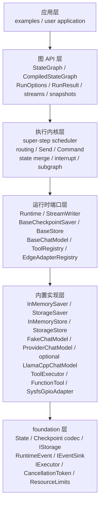

## 架构图：运行内核数据流

这张图只画一次图执行的主路径。旁路能力，例如 checkpoint、events、stream，挂在主路径旁边。

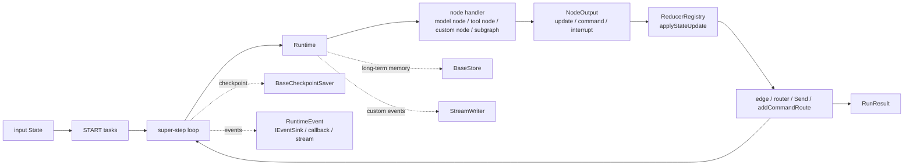

## 架构图：扩展端口与默认实现

这张图回答“用户可以替换哪些东西”。为避免线条交叉，这里按端口族拆成独立泳道；
每条泳道都只表达：使用方 -> 可替换端口 -> 默认实现 -> 外部依赖。

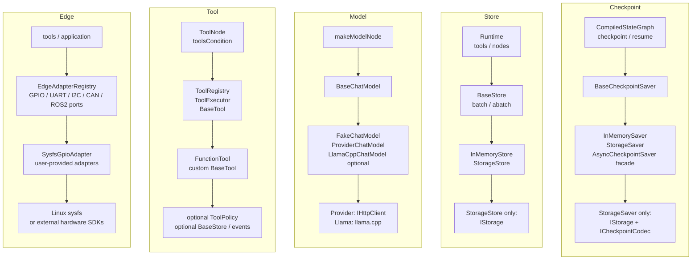

## 类图：图运行时核心

这张图只保留 graph runtime 的核心控制对象。状态值、命令值和 stream 值不再全部连回 `CompiledStateGraph`。

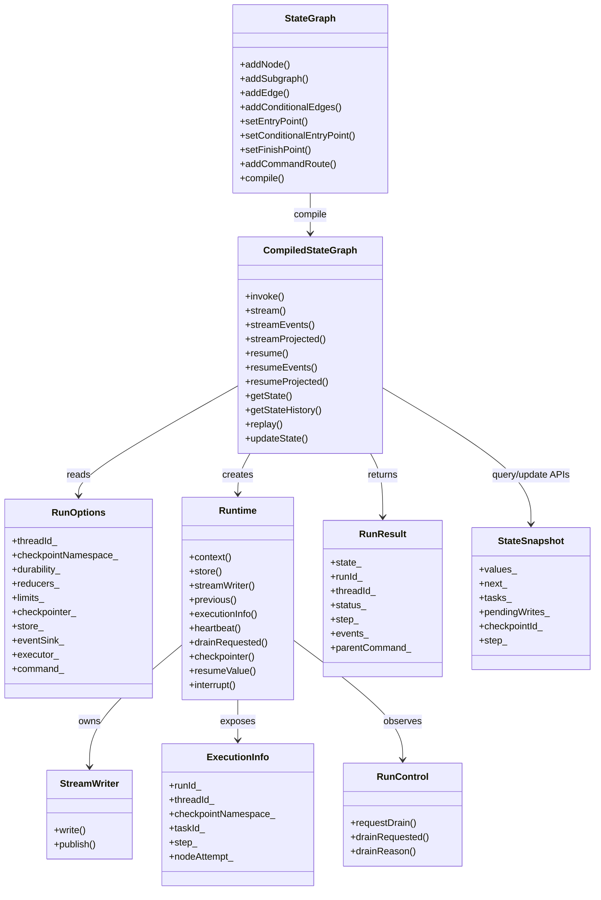

## 类图：图运行时值类型

这张图把更新、暂停、跳转、fan-out 这些值类型单独放一张图，避免和控制对象搅在一起。

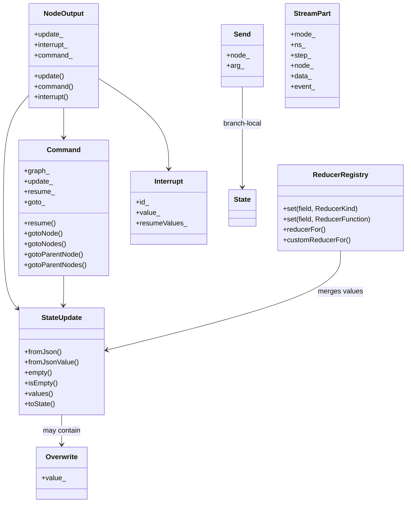

## 类图：Checkpoint

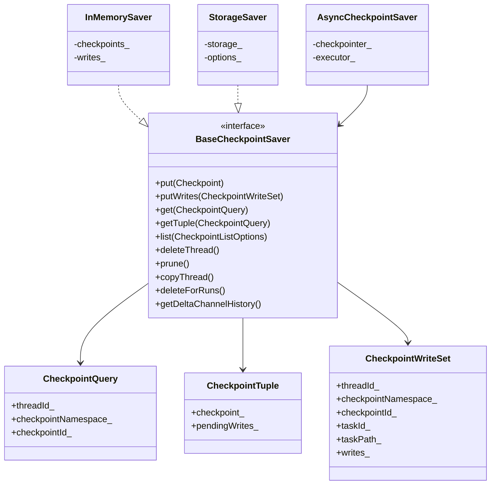

## 类图：Store

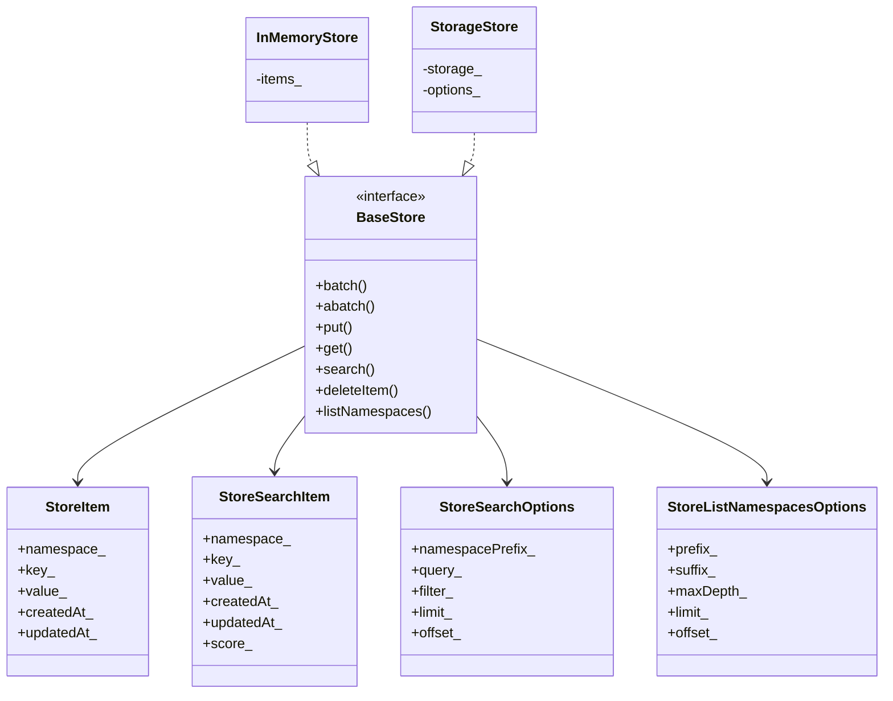

## 类图：BaseMessage 与 Model

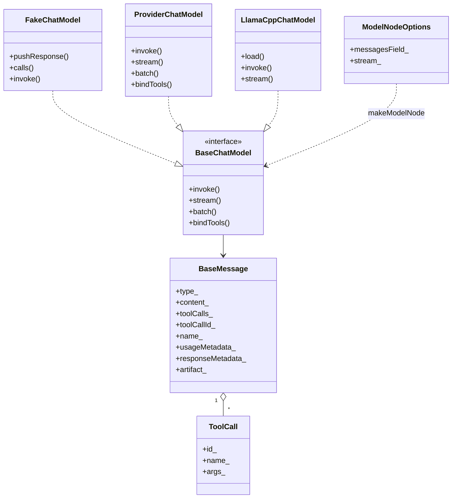

## 类图：Tool 与 Grammar

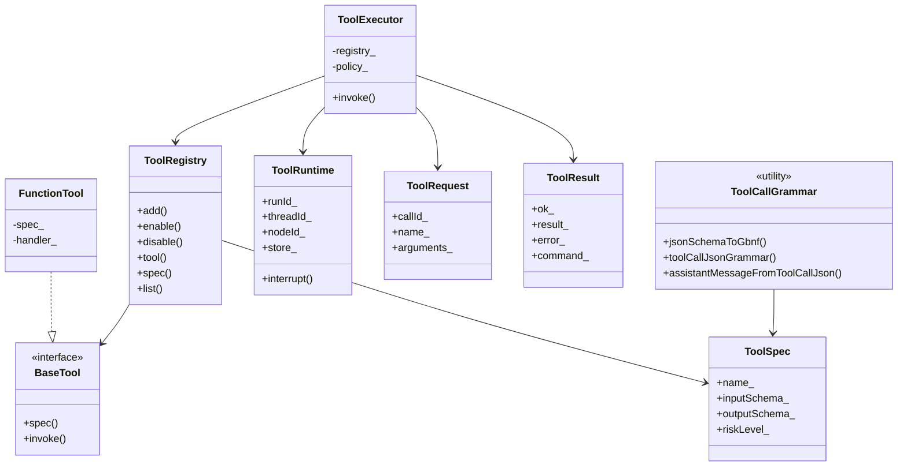

## 类图：Edge adapters

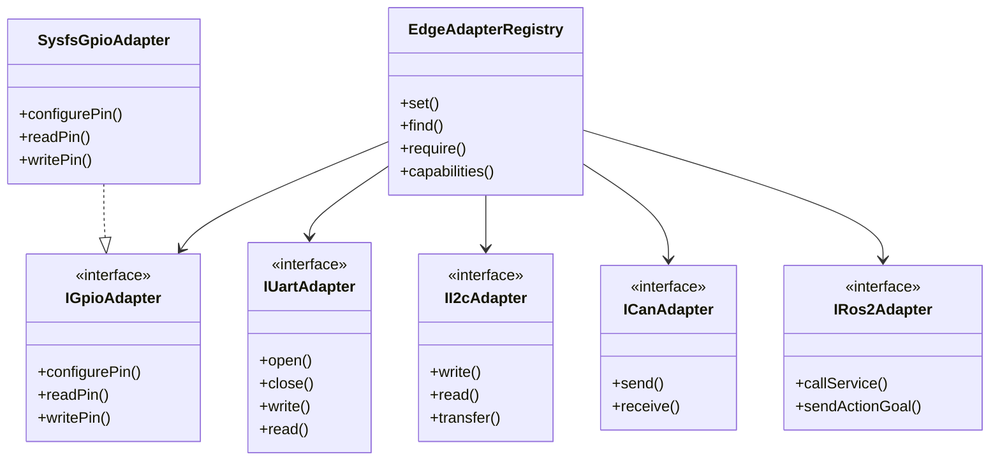

## 时序图：普通 invoke / stream 执行

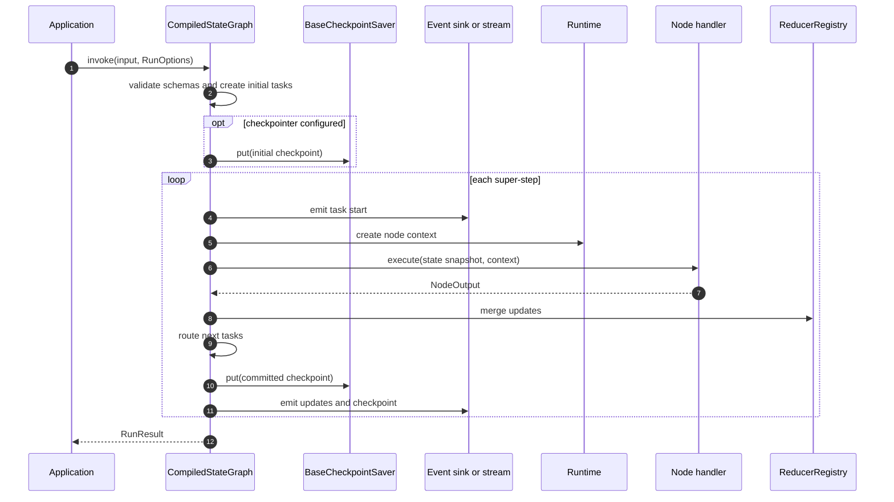

## 时序图：interrupt / resume

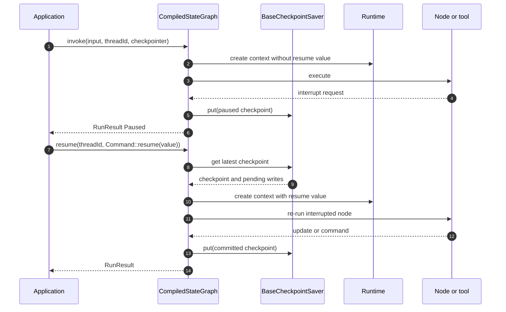

## 时序图：model -> tool -> model agent loop

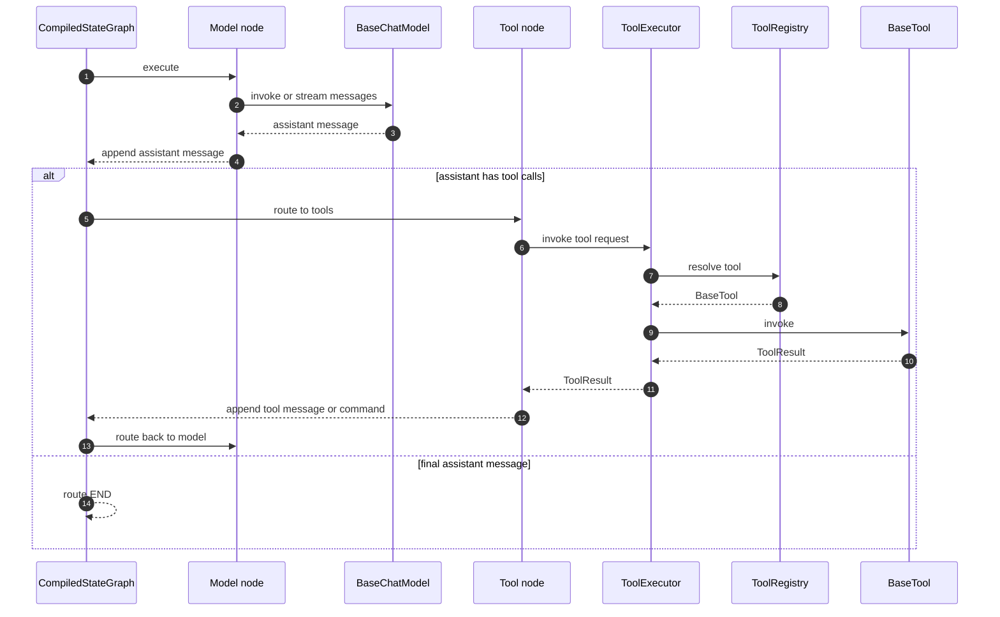

## 时序图：父图调用子图

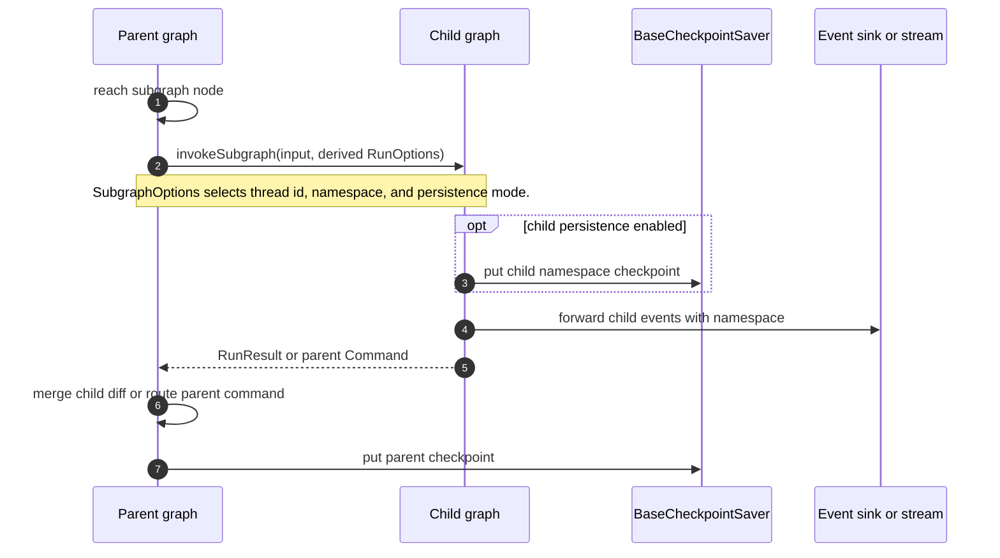

## 端口与实现矩阵

| 端口 / API | 默认实现 | 主要归属 |
| --- | --- | --- |
| `BaseCheckpointSaver` | `InMemorySaver`、`StorageSaver` | graph persistence、retention、copy、run deletion、delta history |
| `BaseStore` | `InMemoryStore`、`StorageStore` | long-term memory |
| `BaseChatModel` | `FakeChatModel`、`ProviderChatModel`、可选 `LlamaCppChatModel` | model node |
| `BaseTool` | `FunctionTool` | tool execution |
| `EdgeAdapterRegistry` slots | `SysfsGpioAdapter`、用户提供的 UART/I2C/CAN/ROS2 adapters | edge hardware integration |

## 类型覆盖索引

| 头文件 | 公共类型 |
| --- | --- |
| `core/ids.hpp` | `NodeId`, `ThreadId`, `CheckpointId`, `StepId`, `START`, `END` |
| `state/state_update.hpp` | `StateUpdate`, `Overwrite` |
| `state/reducer.hpp` | `ReducerKind`, `ReducerFunction`, `ReducerRegistry`, `applyStateUpdate()` |
| `runtime/runtime.hpp` | `RuntimeEventPublisher`, `ExecutionInfo`, `RunControl`, `StreamWriter`, `Runtime` |
| `graph/state_graph.hpp` | handler aliases, `Send`, `Interrupt`, `CommandGraph`, `Durability`, `SubgraphPersistenceMode`, `Command`, `NodeOutput`, `NodeErrorHandler`, `NodeRetryPolicy`, `NodeOptions`, `RunStatus`, `RunOptions`, `RunResult`, `StateSchemaOptions`, `StateSnapshot`, `StateUpdateOptions`, `RunStreamOptions`, `StreamMode`, `StreamPart`, `RunProjectionOptions`, `RunEventStream`, `RunPartStream`, `SubgraphOptions`, `StateGraph`, `CompiledStateGraph` |
| `checkpoint/checkpointer.hpp` | `CheckpointListOrder`, `CheckpointQuery`, `CheckpointWriteSet`, `CheckpointTuple`, `CheckpointListOptions`, `CheckpointPruneOptions`, `CheckpointMaintenanceResult`, `CheckpointCopyThreadOptions`, `CheckpointDeleteForRunsOptions`, `DeltaChannelHistoryQuery`, `DeltaChannelHistory`, `DeltaChannelHistories`, `BaseCheckpointSaver`, `InMemorySaver`, `StorageSaverOptions`, `StorageSaver`, `AsyncCheckpointSaver` |
| `store/store.hpp` | `StoreNamespace`, `StoreItem`, `StoreSearchItem`, `StoreSearchOptions`, `StoreListNamespacesOptions`, `StoreNamespaceMatchType`, `StoreNamespaceMatchCondition`, `StoreGetOp`, `StoreSearchOp`, `StorePutOp`, `StoreListNamespacesOp`, `StoreOp`, `StoreBatchResult`, `BaseStore`, `InMemoryStore`, `StorageStoreOptions`, `StorageStore` |
| `message/message.hpp` | `MessageType`, `ToolCall`, `BaseMessage`, message and tool-call JSON helpers |
| `model/chat_model.hpp` | `ToolCallChunk`, `AIMessageChunk`, `AIMessageChunkHandler`, `ChatModelTool`, `ChatModelToolBinding`, `BaseChatModel`, `FakeChatModel`, `ModelNodeOptions`, `makeModelNode()` |
| `model/provider_chat_model.hpp` | `ChatProviderKind`, `ProviderPromptOptions`, `ProviderChatModelOptions`, `ProviderChatModel` |
| `model/llamacpp_chat_model.hpp` | `LlamaCppChatModelOptions`, `LlamaCppChatModel` when `LANGGRAPH_CPP_WITH_LLAMA_CPP=ON` |
| `tool/tool.hpp` | `ToolCallable`, `ToolInterruptHandler`, `ToolRequest`, `ToolRuntime`, `ToolErrorCode`, `ToolError`, `ToolResult`, `ToolRiskLevel`, `ToolSpec`, `Tool`, `BaseTool`, `ToolHandler`, `FunctionTool`, `ToolAuthorization`, `ToolPolicy`, `ToolRegistry`, `ToolExecutor`, `ToolNodeOptions`, `ToolNode`, `toolsCondition` |
| `tool/tool_call_grammar.hpp` | `GbnfGrammarOptions`, `ToolCallGrammarOptions`, `jsonSchemaToGbnf()`, `toolCallJsonGrammar()`, `assistantMessageFromToolCallJson()` |
| `edge/hardware.hpp` | `HardwareBytes`, GPIO/UART/I2C/CAN/ROS2 config/value structs, `IGpioAdapter`, `SysfsGpioAdapter`, `IUartAdapter`, `II2cAdapter`, `ICanAdapter`, `IRos2Adapter`, `EdgeAdapterCapabilities`, `EdgeAdapterRegistry` |
